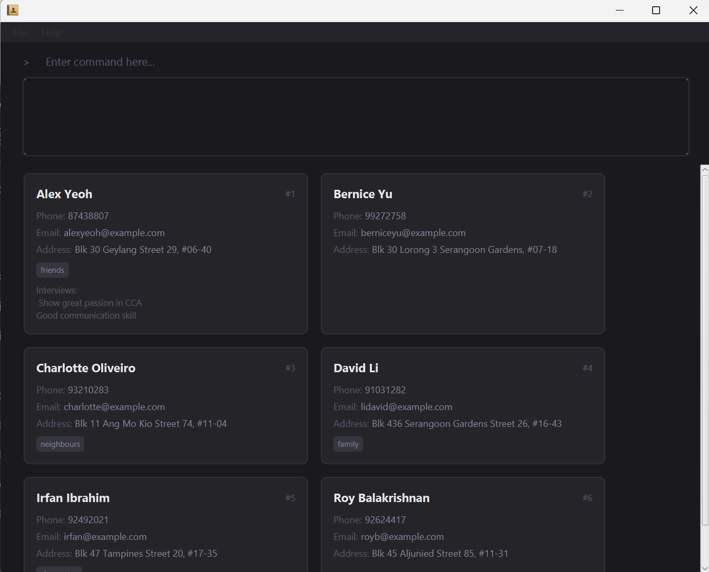

HRdex is a desktop application designed for **CCA leaders in NUS** who need a simple and efficient way to manage CCA's interview records.

The application is optimized for users who prefer a **Command Line Interface (CLI)** while still benefiting from a graphical interface. HRdex allows CCA leaders to quickly add, search, view, and delete a person's information without navigating complicated menus.

* If you are interested in using HRdex, head over to the [_Quick Start_ section of the **User Guide**](UserGuide.html#quick-start).
* If you are interested about developing HRdex, the [**Developer Guide**](DeveloperGuide.html) is a good place to start.

**Acknowledgements**

* Libraries used: [JavaFX](https://openjfx.io/), [Jackson](https://github.com/FasterXML/jackson), [JUnit5](https://github.com/junit-team/junit5)
